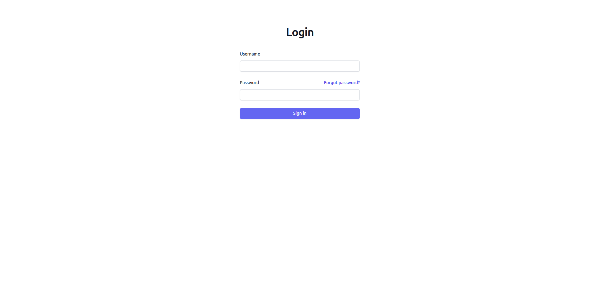
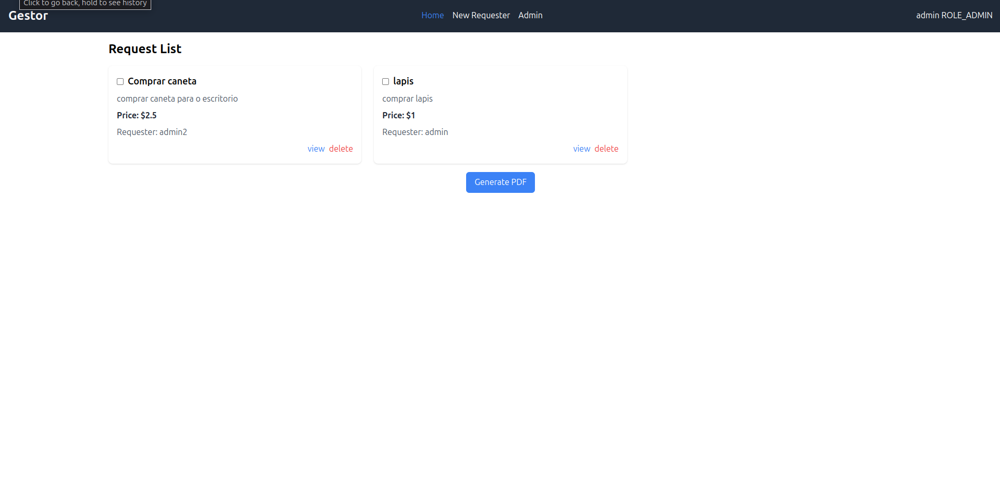
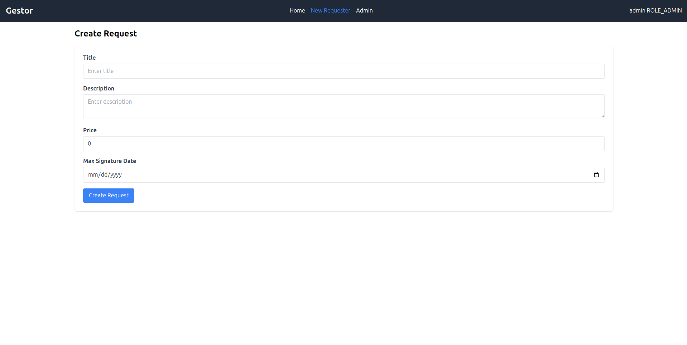
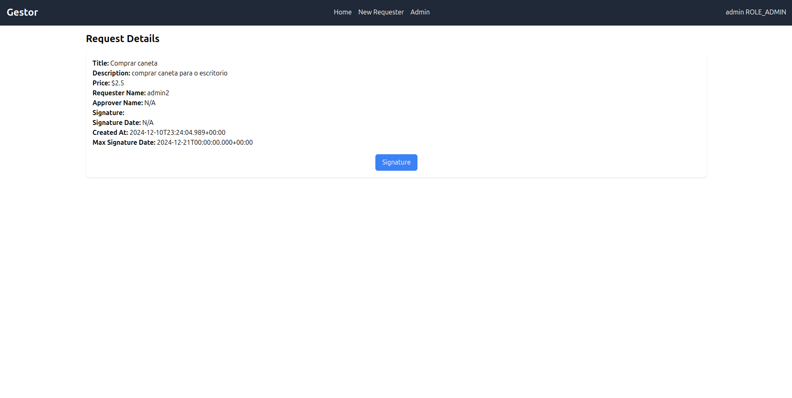
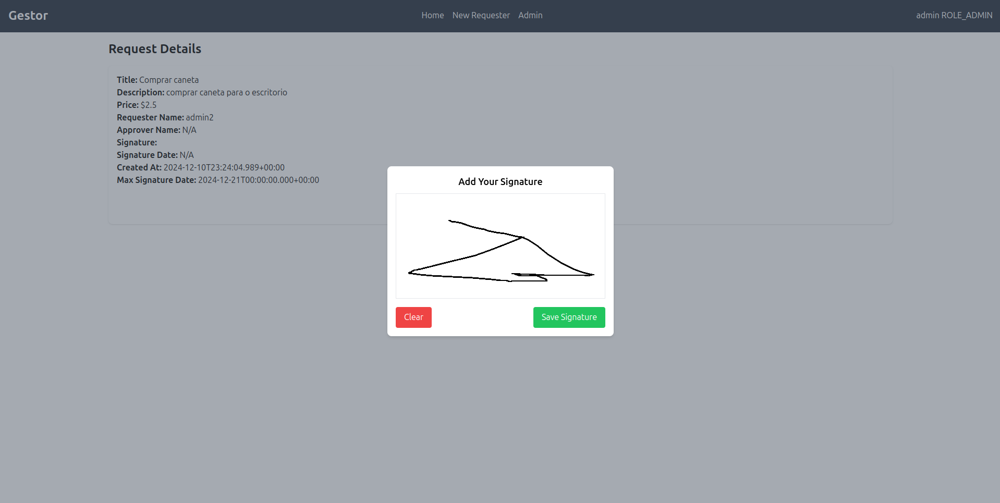
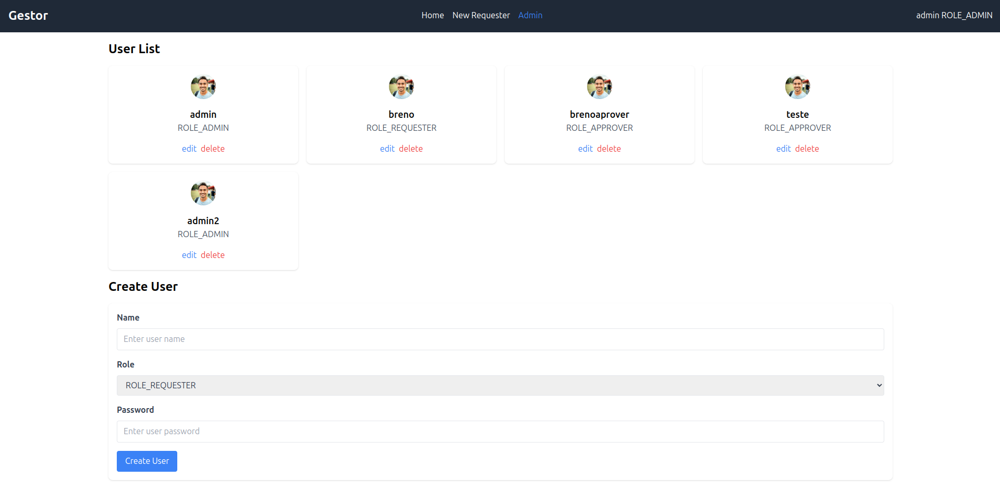

# API para Gerenciamento de Permissões

## ✨ Sobre o Projeto
Esta API foi desenvolvida para gerenciar permissões de trabalho. Ela fornece funcionalidades como criar, editar, excluir e listar permissões, com um sistema robusto de autenticação e autorização baseado em JWT.

## ⚖️ Tecnologias Utilizadas
- **Java 17**
- **Spring Boot 3.3.5**
- **Spring Security**
- **Spring Data JPA**
- **MySQL**
- **Java JWT**
- **Lombok**
- **Spring Boot DevTools**
- **Spring Boot Starter Test**

## Como ficou o [frontend](https://github.com/BrenoC4rvalho/gestor-de-compras-frontend)

</img>
----------
</img>
----------
</img>
----------
</img>
----------
</img>
----------
</img>

## 🚀 Como Configurar o Projeto

### 1. Configurar o Banco de Dados
A API utiliza MySQL como banco de dados. Certifique-se de ter o MySQL instalado e rodando na sua máquina.

1. Crie um banco de dados chamado `permissoes_db`:
   ```sql
   CREATE DATABASE permissoes_db;
   ```

2. Execute o seguinte script SQL para criar um usuário administrador na primeira execução do projeto:
   ```sql
    INSERT INTO users (name, password) VALUES ('admin', '$2a$12$PY0bbH5OQJuiLepgsFqsQuqHmTBRxouwTMFeJs.LegUNEg2OQ7RBi');
    INSERT INTO roles (name) VALUES ('ROLE_ADMIN');
   ```
   
### 2. Configurar o `application.properties`
Atualize o arquivo `src/main/resources/application.properties` com as credenciais do seu banco de dados:

```properties
spring.datasource.url=jdbc:mysql://localhost:3306/permissoes_db
spring.datasource.username=seu_usuario
spring.datasource.password=sua_senha

spring.jpa.hibernate.ddl-auto=update
spring.jpa.show-sql=true
spring.jpa.properties.hibernate.dialect=org.hibernate.dialect.MySQLDialect

jwt.secret=seu_segredo_jwt
jwt.expiration=86400000
```

### 3. Instalar Dependências e Rodar o Projeto

Certifique-se de ter o Maven configurado na sua máquina.

1. Instale as dependências:
   ```bash
   mvn clean install
   ```

2. Inicie a aplicação:
   ```bash
   mvn spring-boot:run
   ```

A API estará rodando em [http://localhost:8080](http://localhost:8080).

## 🔧 Endpoints

### 1. Endpoints Públicos

#### Autenticação de Usuários
- **POST** `/signin`
  - **Descrição:** Realiza a autenticação do usuário e retorna um token JWT.
  - **Corpo da Requisição:**
    ```json
    {
      "username": "usuario",
      "password": "senha"
    }
    ```
  - **Resposta:**
    ```json
    {
      "token": "jwt_token"
    }
    ```

### 2. Endpoints Privados
#### 2.1. Requisições (Acesso Geral)

- **GET** `/request`
  - **Descrição:** Retorna uma lista de todas as permissões.
  - **Acesso:** Requer autenticação.

- **GET** `/request/{id}`
  - **Descrição:** Retorna os detalhes de uma permissão específica.
  - **Acesso:** Requer autenticação.

- **POST** `/request`
  - **Descrição:** Cria uma nova permissão de trabalho.
  - **Acesso:** Requer autenticação.
  - **Corpo da Requisição:**
    ```json
    {
      "nomePermissao": "Permissão para Manutenção",
      "itens": [
        { "categoria": "Dados da Empresa", "item": "Nome da Empresa", "valor": "CSN" }
      ]
    }
    ```

#### 2.2. Ações de Administração (Apenas Admins)

- **POST** `/admin/user`
  - **Descrição:** Cria um novo usuário.
  - **Acesso:** Apenas administradores.
  - **Corpo da Requisição:**
    ```json
    {
      "username": "usuario",
      "password": "senha",
      "roles": ["ROLE_USER"]
    }
    ```

- **GET** `/admin/user`
  - **Descrição:** Retorna uma lista de todos os usuários.
  - **Acesso:** Apenas administradores.

#### 2.3. Aprovação de Permissões (Apenas Aprovadores)

- **PATCH** `/request/approver/{id}`
  - **Descrição:** Aprova uma permissão adicionando uma assinatura.
  - **Acesso:** Apenas aprovadores.
  - **Corpo da Requisição:**
    ```json
    {
      "signature": "Assinatura do Aprovador"
    }
    ```

## 🌐 Estrutura de Permissões

### Endpoints por Tipo de Acesso
- **Públicos:** `/signin`
- **Autenticados:** `/request`, `/request/{id}`, `/recoveryUser`
- **Administradores:** `/admin/user`, `/request/approver/{id}`
- **Aprovadores:** `/request/approver/{id}`
